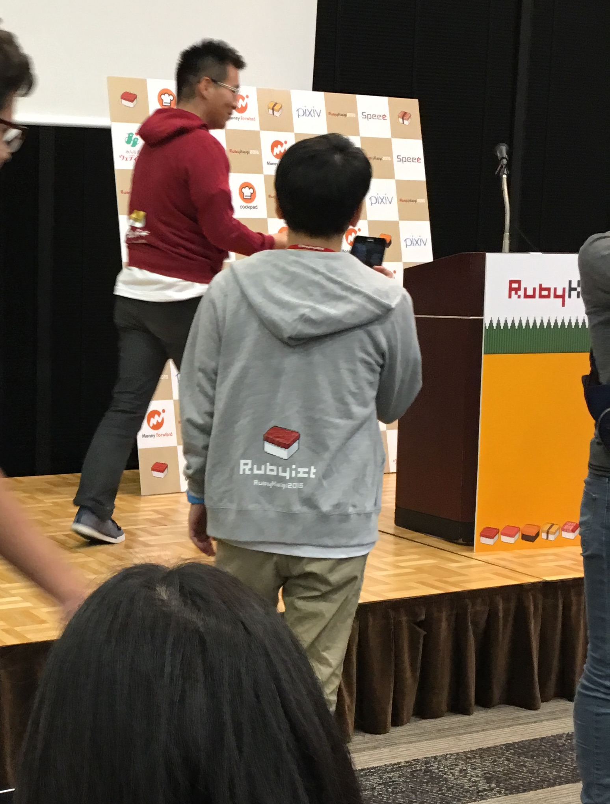

# Shia

안녕하세요. 이번에 창훈님과 함께 루비카이기를 다녀온 심상용이라고 합니다.

---

# [fit] 인상깊었던 부분

저도 이번이 첫 컨퍼런스 경험이었는데요. 이번에 컨퍼런스에서 느꼈던 인상깊었던 부분에 대해서 이야기해볼까 합니다.

---

# [fit] Honest Ruby

첫번째로는 솔직함을 뽑고 싶습니다. 첫번째 키노트에서 마츠, 그러니까 Ruby를 만든 사람의 발표가 있었는데요.

---

# [fit] Ruby 3x3

루비 3.0의 키워드입니다. 의미는 3배 빠른 루비 3.0인데요. 상식적으로 생각해도 메이저버전이 하나 올라갔다고 해서 3배나 빨라질 것이라고는 기대하기 힘듭니다. 심지어 0.x에서 1.0 대라면 모를까, 2에서 3이라면 그렇게 올라가긴 쉽지 않죠.

---

# [fit] 정말 3배는 힘들겠지만
# [fit] 일부러 어려운 목표를 세웠다

그래서 마츠는 정말로 3배의 성능을 얻는 것은 어렵겠지만, 그렇기 때문에 가치가 있다고 말합니다. 그러면서 덧붙인 말은,

---

# [fit] 그러니까 수단과 방법은 가리지 않겠다
## [fit] 유리한 벤치마크를 선택한다든가

웃음 포인트일 수도 있지만, 실제로도 그럴 것이라고 생각하기에 오히려 제게는 무척 솔직하게 들렸습니다.

---

# [fit] 반성의 시간
# [fit] Ruby 1.9에서의 대대적인 변화
# [fit] 적용되는데 오랜 시간이 걸렸다

잘못했던 부분에 대해서도 그렇습니다. 루비 1.8에서 1.9로 넘어가면서 무척 큰 변화가 있었는데, 이 때문에 마이너 버전업임에도 불구하고 사용자들이 넘어가는데에는 5년이라는 시간이 걸렸다고 합니다.
이 부분에 대해서 코어 팀에서 부족했던 부분들을 솔직하게 이야기하고, 이 반성점을 살려서 1.9에서 2.0으로 넘어가는 것은 무척 순조롭게 진행되었다고 합니다.

---

# [fit] 그래도 파이썬 3보다 잘 해냈다!

그래도 파이썬보단 잘 해냈다고 자평하는게 재미있었네요.

---

# [fit] MINASWAN
## [fit] Matz is nice so we are nice

위에서 이야기한 Ruby3x3을 제안한 것은 코어팀이 아닌 다른 루비스트였으며, 무엇보다 많은 사람들이 사용하는 언어가 되었습니다. 이에 따라서 루비 커뮤니티가 향했으면 하는 키워드를 소개했는데요.
마틴 파울러가 제안한 말로 마츠는 좋은 사람이니까, 우리도 좋은 사람이 되자. 이정도의 의미를 품고 있는 말입니다.

---

# [fit] 루비는 더 이상
## [fit] MATZ만의 언어가 아님

여기에 이어서 마츠가 마지막으로 남긴 이 말은 마치 잘 키운 자식을 독립시키는 듯한 느낌이 들어서, 무척 인상이 깊었습니다.

---

# [fit] Fast Feedback

그 다음으로 재밌게 봤던 부분은 빠른 피드백입니다.

---

# [fit] 여기저기 널린 커미터

다른 언어의 컨퍼런스에 가보진 않았지만, 코어 팀 멤버들을 무척 가깝게, 흔하게 볼 수 있어 무척 신선한 느낌이었는데요. 어떻게 알아볼 수 있었냐 하면, 각 참가자들별로 다른 후드가 제공되었기 때문입니다.

---

코어 팀의 커미터들은 왼쪽에서 보시다시피 보라색 후드를 입고 있었습니다. 여성 커미터 분들이 좀 있어서 더 신기하기도 했었네요.
그리고 우측에 볼 수 있는 후드는 발표자용입니다.
사진에서는 알아보기 힘들지만, 아래쪽에 커미터, 스피커라고 적혀있네요.

---

스태프들은 빨간색 후드를, 그리고 일반 참가자들은 제가 오늘 입고 온 회색 후드로 바로바로 그 사람을 알아볼 수 있게끔 배려해두었습니다.

---

# [fit] 구버전과 신버전의 성능 비교 세션

피드백 이야기로 돌아와보죠. 세션 중에서는 이런 것도 있었는데요. 얼핏 들으면 왜 이런게 세션으로 들어가지 싶은데, 그도 그럴 것이 해당 벤치에서는 구버전보다 새버전에서의 성능이 안좋았기 때문입니다.
발표자가 발표를 끝내면서 앞에서 세션을 듣고 있던 커미터들에게 물었습니다.

---

# [fit] Q: 이거 왜이럴까요...

그러자,

---

# [fit] A: 저희도 잘 모르겠습니다.....
# [fit] 그 벤치마킹 코드 공유 좀 부탁드립니다(_ _)

물론 어떤 부분이 의심된다든가 하는 추측은 몇가지 있었지만 좀더 정확한 조사를 위해서 벤치마킹 공유를 부탁하는 모습도 좋았습니다.

또는,

---

# [fit] 커미터도 궁금하다

---

# [fit] Q: 잘 이해는 못했는데 성능이 향상 되었어요

반대로 커미터들이 올해는 이런 신기한 패치가 있었습니다, 라는 이야기를 하다가,

---

# [fit] 혹시 여기 계시나요?

그리고 패치를 작성하신분이 정말로 현장에 계셔서 즉석에서 설명해주시는 등,
이런 식으로 빠르게 의사소통이 이루어지는 모습이 무척 좋아 보였습니다.

---

## [fit] 질문 찬스!
# [fit] 트위터로 물어보세요
현장에 있는 사람 뿐만이 아니라, 트위터를 통해서 질문을 받는 시간도 있었는데요.

---

이런 식으로 해시 태그를 사용해서 질문을 받았구요. 이 중에서 재미있었던 질문을 하나만 소개하고 마무리 지어볼까 합니다. 중앙에 있는 바로 이 것인데요. 많은 루비스트들이 들었을 법한 질문입니다.

---

# [fit] 주변에서 Python 쓰라는데,
# [fit] ...어떻게 하면 좋을까요?

여기에 대한 한 커미터의 대답은,

---

# [fit] 그럼 배우세요

---

# [fit] 그리고 좋은 기능은
# [fit] 루비로 가져와주세요

농담으로 가볍게 넘길 수도 있는 질문이었는데,
성실하게 대답해주는 모습이 기억에 남았습니다.

---

# [fit] END!

여기까지입니다. 감사합니다!
