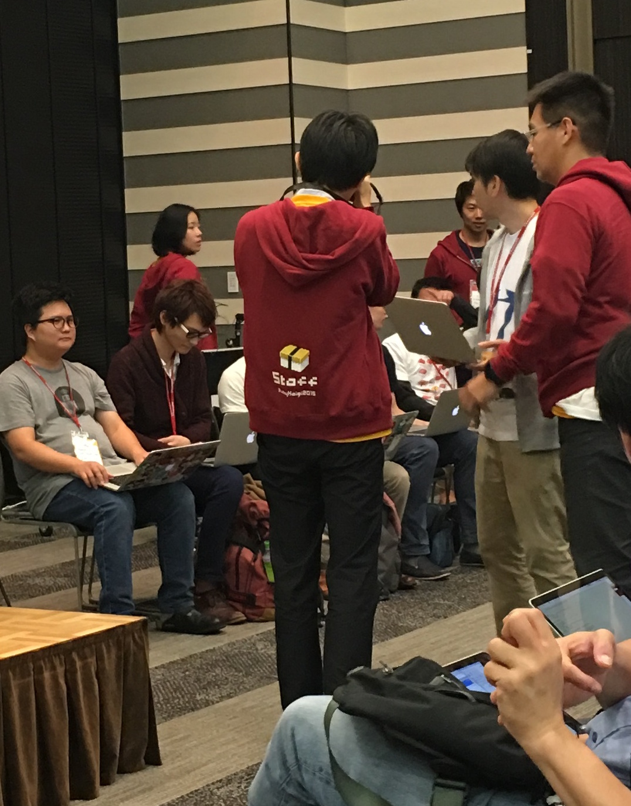

# Shia

---

# [fit] 인상깊었던 부분

---

# [fit] Honest Ruby

---

# [fit] Ruby 3x3

---

# [fit] 정말 3배는 힘들겠지만
# [fit] 일부러 어려운 목표를 세웠다

---

# [fit] 그러니까 수단과 방법은 가리지 않겠다
## [fit] 유리한 벤치마크를 선택한다든가

---

# [fit] 반성의 시간
# [fit] Ruby 1.9에서의 대대적인 변화
# [fit] 적용되는데 오랜 시간이 걸렸다

---

# [fit] 그래도 파이썬 3보다 잘 해냈다!

---

# [fit] 루비는 더 이상
## [fit] MATZ만의 언어가 아님

---

# [fit] MINASWAN
## [fit] Matz is nice so we are nice

---

# [fit] Fast Feedback

---

# [fit] Ruby 3x3
# [fit] Opening with Matz

---

# [fit] What could we do?
# [fit] Closing with Evan Phoenix

---

# [fit] 여기저기 널린 커미터

---

---

---

# [fit] 커미터들에게 궁금한거 물어보는 세션
# [fit] Q: 더 느려졌는데 왜죠?

---

# [fit] 듣고 있던 커미터가 바로 대답

---

# [fit] 커미터도 궁금하다
# [fit] 루비스트에게 역질문
# [fit] Q: 잘 이해는 못했는데 성능이 향상 되었어요

---

# [fit] 현장에 있던
# [fit] 패치 작성자가 바로 대답

---

## [fit] 질문 찬스!
# [fit] 트위터로 물어보세요

---

# [fit] Q: Python 쓰라는데
# [fit] ...어떻게 하죠?

---

# [fit] 일단 가서 배우세요

---

# [fit] 그리고 좋은 기능은
# [fit] 루비로 가져와주세요

---

---

# [fit] END!
